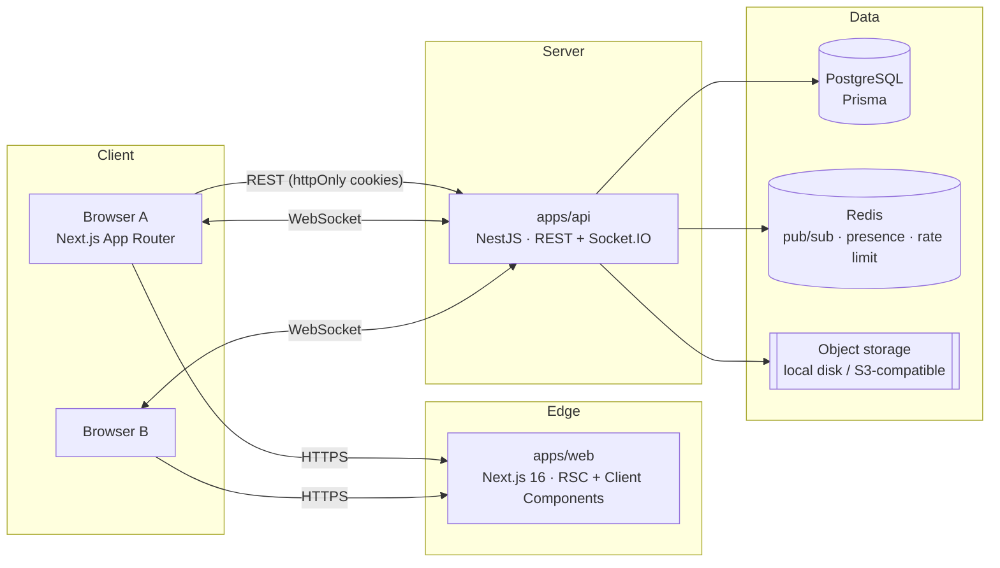
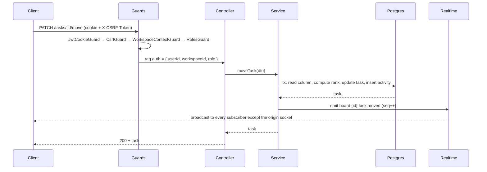
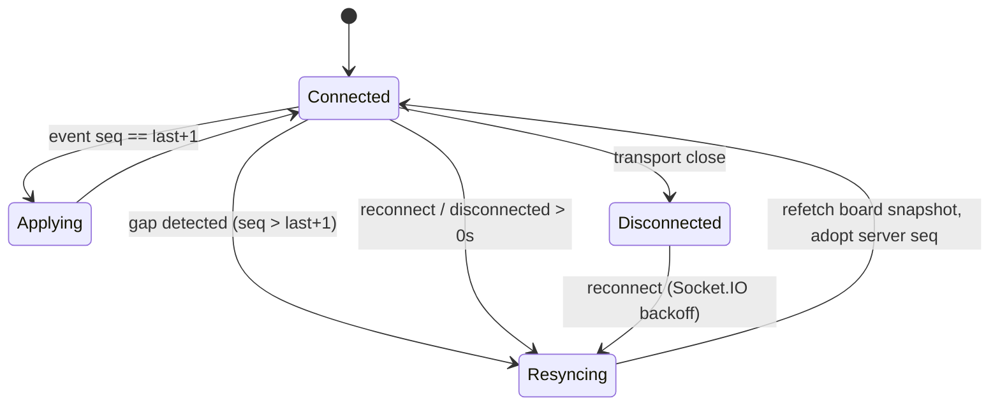
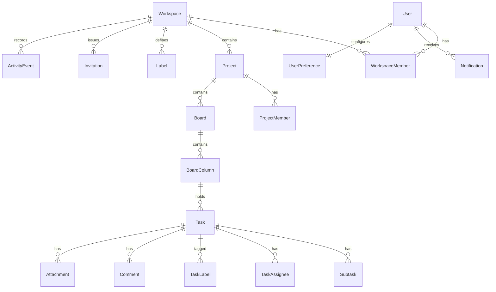

# FlowSync — Architecture

## 1. System overview

FlowSync is a **modular monolith** split into two deployables (a Next.js web app and a
NestJS API) inside one npm-workspaces monorepo. There are no microservices: the domain
is cohesive, the transaction boundaries are small, and a single API process keeps the
real-time layer simple and consistent.



## 2. Repository layout

```
apps/
  web/          Next.js App Router frontend
  api/          NestJS REST API + Socket.IO gateway
packages/
  shared/       Zod schemas, DTO types, realtime event contracts, rank algorithm
  config/       Shared ESLint / Prettier / TypeScript base configs
docs/           Architecture, security, decisions, portfolio
scripts/        Dev and CI helper scripts
```

`packages/shared` is the single source of truth for the wire contract. The API validates
inbound payloads with the same Zod schemas the web app uses in its forms, and realtime
event payload types are imported by both sides — a mismatch is a compile error.

## 3. Backend module map

```
api/src/
  common/        guards, interceptors, filters, decorators, pagination, logger
  prisma/        PrismaService + transaction helpers
  redis/         RedisService (+ in-memory fallback for unit tests)
  auth/          signup, signin, refresh rotation, CSRF, password hashing
  users/         profile, preferences
  workspaces/    workspace CRUD, members, roles, invitations
  projects/      project CRUD, members, statuses
  boards/        boards, columns, reordering
  tasks/         tasks, subtasks, assignees, labels, movement/ranking
  comments/      comments + @mentions
  attachments/   upload pipeline + storage drivers
  activity/      activity event recording + feed
  notifications/ notification fan-out + read state
  search/        cross-entity search
  realtime/      Socket.IO gateway, room registry, event bus, presence
```

Cross-module communication goes through injected services (e.g. `TasksService` calls
`ActivityService.record()` and `RealtimeService.emit()`), never through HTTP self-calls.

## 4. Request pipeline



Guard order is fixed and enforced globally:

1. **JwtCookieGuard** — verifies the access token from the `fs_at` httpOnly cookie.
2. **CsrfGuard** — double-submit check on every state-changing verb.
3. **WorkspaceContextGuard** — resolves the workspace from the route/resource and loads
   the caller's `WorkspaceMember` row. A missing membership is a `404`, not a `403`,
   so workspace existence cannot be probed.
4. **RolesGuard** — compares the resolved role against `@RequireRole(...)` metadata.

## 5. Multi-tenancy

Every tenant-owned table carries `workspaceId`. Resource resolution always starts from
the workspace:

- Route params carry the workspace slug or id for workspace-scoped routes.
- For deep resources (`/tasks/:id`), the service loads the task **joined to its
  workspace** and compares it against the caller's memberships in the same query.
  There is no code path that fetches a task by id alone and then checks ownership
  afterwards.
- `packages/shared` exposes no client-trusted workspace id: the server derives it.

The isolation guarantee has a dedicated test suite (`test/tenant-isolation.e2e-spec.ts`)
that walks every resource family with a member of another workspace and asserts `404`.

## 6. Real-time architecture

### 6.1 Transport

Socket.IO v4 over the same origin as the REST API. Chosen over raw `ws` for built-in
reconnection with backoff, acknowledgements, room semantics and a battle-tested Redis
adapter — all of which we would otherwise reimplement (`DECISIONS.md` D-006).

### 6.2 Handshake authentication

The socket handshake reuses the httpOnly access-token cookie. There is no token in
`localStorage` and no token in the query string (which would leak through logs and
`Referer`). An unauthenticated handshake is rejected before any room is joined.

### 6.3 Rooms and subscription authorization

| Room                      | Membership rule                                          |
| ------------------------- | -------------------------------------------------------- |
| `user:{userId}`           | joined automatically for the authenticated socket only   |
| `workspace:{workspaceId}` | requires an active `WorkspaceMember` row                 |
| `project:{projectId}`     | requires workspace membership **and** project visibility |
| `board:{boardId}`         | requires access to the board's project                   |

The client asks to subscribe (`subscribe:board`), the server re-checks authorization in
the database, and only then calls `socket.join()`. Client-supplied ids are never trusted
as proof of access.

### 6.4 Event envelope

```ts
type RealtimeEnvelope<T> = {
  id: string; // uuid — used for client-side de-duplication
  type: RealtimeEventType;
  room: string; // e.g. "board:ckx..."
  seq: number; // monotonic per room
  ts: string; // ISO timestamp
  actorId: string; // who caused it
  payload: T;
};
```

`seq` comes from `INCR realtime:seq:{room}` in Redis (falling back to a per-process
counter when Redis is disabled in unit tests).

### 6.5 Ordering, duplicates and resynchronization



- **Ordering**: per-room `seq`. The client applies an event only when it is the next
  expected sequence; anything ahead triggers a resync instead of an out-of-order apply.
- **Duplicates**: an LRU of the last 500 event ids per room; a repeated `id` is dropped.
  This also absorbs the "my own mutation returned over REST _and_ arrived over the
  socket" case, together with the origin-socket suppression below.
- **Echo suppression**: the mutating socket sends its `socketId` in the
  `X-Socket-Id` header; the server broadcasts with `.except(socketId)` so the actor
  never receives its own echo and its optimistic state is not clobbered.
- **Resync**: on reconnect the client invalidates the board query and adopts the server's
  current `seq` from the snapshot response.

### 6.6 Conflict strategy

Server-authoritative **last-write-wins with field-level granularity**:

- Task updates patch only the fields present in the request, so two people editing
  different fields of the same task do not overwrite each other.
- Moves are _not_ last-write-wins on the client's proposed rank. The client sends
  `{ columnId, beforeTaskId, afterTaskId }` and the **server** computes the final rank
  inside a transaction. Two concurrent drops onto the same slot therefore produce two
  distinct, well-ordered ranks rather than a collision.
- Comment bodies are single-author, so LWW is safe by construction.
- Full CRDT convergence is unnecessary at this granularity and is documented as a
  deliberate non-goal.

## 7. Task ordering (ranking)

Tasks and columns are ordered by a **fractional lexicographic rank string** (base-62,
LexoRank-style) stored in `Task.rank` / `BoardColumn.rank`.

```
insert between "a1" and "a3"  ->  "a2"
insert between "a1" and "a2"  ->  "a1V"
append after "z"              ->  "zV" ... (never exhausts, grows in length)
```

Why not integer positions: reordering one card would rewrite every row after it
(`O(n)` writes and an `O(n)` realtime payload). Why not floats: they exhaust ~50
midpoint insertions and lose precision silently. Rank strings give `O(1)` writes,
`O(1)` realtime payloads, and a deterministic rebalance path when a rank grows past
`RANK_MAX_LENGTH` (server rebalances the column in one transaction and emits
`board.updated`, which triggers a client resync).

Uniqueness is enforced by `@@unique([columnId, rank])`; a collision retries with a
freshly computed midpoint.

## 8. Frontend architecture

- **Next.js App Router**. Marketing pages (`/`, pricing, etc.) are server-rendered
  static; the authenticated app under `/app/**` is a client-side SPA shell because it
  is realtime-driven and long-lived — RSC streaming buys nothing for a board that
  mutates over a socket.
- **TanStack Query is the single client cache.** Realtime events are applied with
  `queryClient.setQueryData` (surgical cache writes), _not_ `invalidateQueries`, so a
  20-event burst causes zero refetches.
- **Zustand** holds only ephemeral, non-server UI state: command palette open/closed,
  board filter state, socket connection status. No server data lives there.
- **dnd-kit** drives the board. Drag state is local; on drop we fire an optimistic cache
  mutation and reconcile against the server's authoritative rank.
- Forms: React Hook Form + the shared Zod schemas via `@hookform/resolvers`.

```
web/src/
  app/                 routes (marketing + /app authenticated shell)
  components/          ui/ (shadcn primitives), board/, task/, layout/, ...
  features/            per-domain hooks + api clients (tasks, boards, comments, ...)
  lib/                 api client, socket client, query client, utils
  stores/              zustand slices (ui only)
```

## 9. Data model



Full column-level detail lives in `apps/api/prisma/schema.prisma`, which is the
authoritative source and is kept readable on purpose.

## 10. API surface

REST, cookie-authenticated, documented with OpenAPI at `/api/docs`.

```
/auth          signup · signin · signout · me · refresh · csrf
/users         profile · preferences · avatar
/workspaces    CRUD · members · roles · invitations
/projects      CRUD · members · archive
/boards        CRUD · columns · reorder
/tasks         CRUD · move · assignees · labels · subtasks
/comments      CRUD (nested under tasks)
/attachments   upload · download · delete
/notifications list · read · read-all
/activity      cursor-paginated feed
/search        cross-entity search
```

Collections that grow without bound (activity, notifications, comments, search) use
**cursor pagination** (`?cursor=&limit=`) returning `{ items, nextCursor }`. Bounded
collections (a board's columns, a task's subtasks) are returned whole.

## 11. Storage abstraction

```ts
interface StorageDriver {
  put(key: string, body: Buffer, contentType: string): Promise<StoredObject>;
  getStream(key: string): Promise<Readable>;
  delete(key: string): Promise<void>;
  signedUrl(key: string, ttlSeconds: number): Promise<string>;
}
```

`LocalDiskDriver` (development, files under `var/uploads`, served through an authorized
API route — never as static files) and `S3Driver` (`@aws-sdk/client-s3`, works with AWS
S3, Cloudflare R2, MinIO). Selected by `STORAGE_DRIVER`.

## 12. Observability

Structured JSON logging (Pino) with a per-request `requestId`, `userId`, `workspaceId`
and route. Socket lifecycle events are logged at the same structure. A redaction list
strips `password`, `token`, `authorization`, `cookie`, `secret` from every log record.
